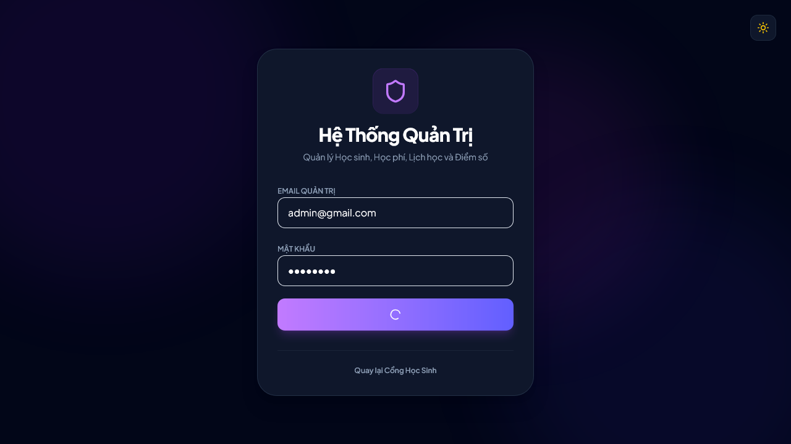
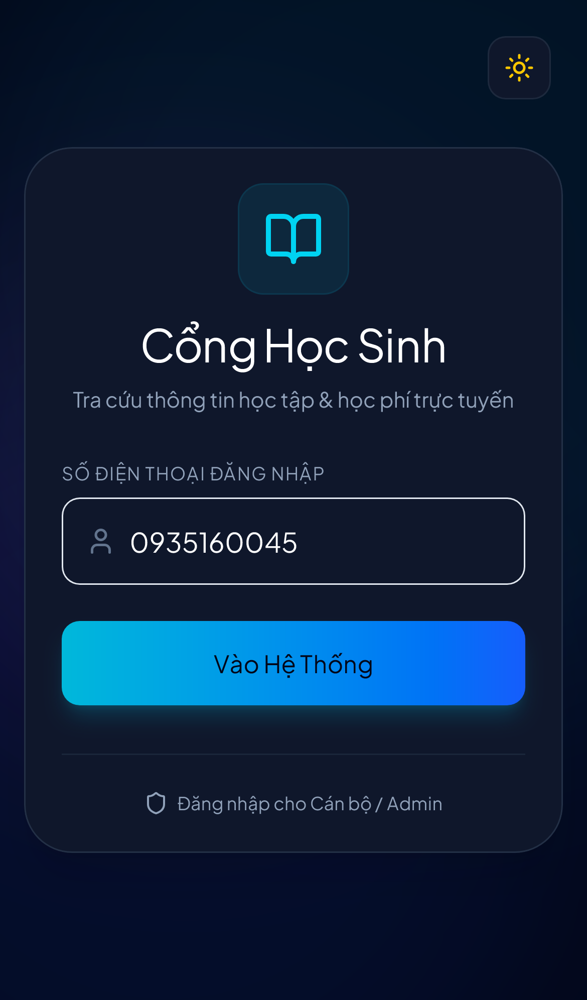

  
  <h1>🎓 EduManager Pro</h1>
  
<em>Nền Tảng Quản Lý Trung Tâm & Học Phí Toàn Diện Thế Hệ Mới</em>

  

    
    
    
  

---

## 🌟 Về Sản Phẩm

**EduManager Pro** (Student Tuition Web) không chỉ là một phần mềm quản lý thông thường, mà là một hệ sinh thái số hóa toàn diện dành cho các trường học, trung tâm ngoại ngữ và cơ sở giáo dục. 

Thay vì những bảng tính Excel cồng kềnh, EduManager Pro mang đến một giao diện **Glassmorphism** cực kỳ sang trọng, trải nghiệm **Bento Grid** hiện đại, kết nối WebSockets siêu tốc thời gian thực (**Realtime**) và quy trình tự động hóa cao. Hệ thống được tích hợp tiêu chuẩn bảo mật khắt khe và hệ thống **Audit Logs** (nhật ký hoạt động) cấp độ doanh nghiệp.

Sản phẩm cung cấp **3 cổng thông tin độc lập** đem lại trải nghiệm cá nhân hóa tối đa:
- 👑 **Admin Portal:** Trạm điều khiển trung tâm dành cho Quản trị viên/Giáo viên.
- 👨‍🎓 **Student Portal:** Không gian học tập số hóa chuyên biệt dành cho Học sinh.
- 👨‍👩‍👧‍👦 **Parent Portal:** Ứng dụng đồng hành sát sao cùng Phụ huynh.

---

## 📸 Hình Ảnh Giao Diện & 🎥 Video Demo

  <h3>Video Trải Nghiệm Thực Tế Toàn Bộ Quy Trình</h3>
  <video src="./assets/demo.webm" controls="controls" muted="muted" style="max-height:640px; min-height: 200px">
  </video>

 

  <table>
    <tr>
      <td align="center"><b>Admin Portal</b></td>
      <td align="center"><b>Student Portal</b></td>
      <td align="center"><b>Parent Portal</b></td>
    </tr>
    <tr>
      <td></td>
      <td></td>
      <td></td>
    </tr>
  </table>

---

## 🚀 Tính Năng Chi Tiết Theo Từng Vai Trò (Core Features by Roles)

### 👑 1. Cổng Quản Trị Trung Tâm (Admin Portal)
*Dành cho Ban giám đốc, Giáo viên, Quản trị viên hệ thống.*

- 📊 **Dashboard Toàn Cảnh (Real-time Dashboard):** 
  - Theo dõi số lượng học sinh, tổng thu nhập, sĩ số lớp học, và học phí chờ duyệt. Dữ liệu được cập nhật tự động (Realtime) qua Supabase WebSockets khi có sự kiện phát sinh mà không cần tải lại trang.
- 🏫 **Quản Lý Lớp Học & Phân Bổ (Class Management):**
  - Khởi tạo lớp học mới, cấu hình mức học phí, niên khóa, môn học.
  - Phân bổ học sinh vào lớp linh hoạt (thêm mới hoặc loại bỏ khỏi lớp).
  - Tự động phát hiện và chuyển học sinh "vô gia cư" (Lớp Tạm) vào lớp chính thức dựa trên tên lớp học.
- 💰 **Quản Lý Học Phí & Biên Lai (Tuition & Billing):**
  - Tạo mới các khoản học phí định kỳ (Học phí tháng, Tài liệu, Khóa học) cho cá nhân hoặc toàn bộ lớp.
  - Quét mã QR thanh toán (VietQR) tự động tạo nội dung chuyển khoản chuyên biệt.
  - **Xác nhận/Từ chối giao dịch:** Khi học sinh khai báo đã chuyển khoản (trạng thái Pending), Admin dễ dàng kiểm duyệt, cập nhật trạng thái "Đã thanh toán" (Paid) hoặc "Từ chối" (Rejected). Hệ thống tự động báo kết quả về cho học sinh.
  - Sinh xuất PDF biên lai hóa đơn điện tử bảo mật.
- 📅 **Lịch Học Trực Tuyến (Scheduling):**
  - Khởi tạo lịch học, gán phòng học, thời gian, giáo viên phụ trách.
  - **Thuật toán kiểm tra trùng lịch (Conflict Checking):** Tự động cảnh báo và từ chối nếu lớp học, giáo viên, hoặc phòng học đã bị chiếm dụng vào thời điểm đó.
- ✉️ **Quy Trình Xin Nghỉ Phép (Leave Requests):**
  - Tiếp nhận đơn xin nghỉ phép từ học sinh. Quản lý trạng thái chờ duyệt, chấp thuận hoặc từ chối kèm lý do. Hệ thống tự động gửi thông báo notification kết quả.
- 📈 **Sổ Điểm & Giao Bài Tập (Grades & Assignments):**
  - Cập nhật điểm thành phần (15 phút, 45 phút, giữa kỳ, cuối kỳ) cho toàn bộ lớp học một cách hàng loạt. Tính điểm tổng kết tự động.
  - Giao bài tập qua nền tảng, đính kèm link/tài liệu hướng dẫn, cấu hình hạn nộp (Deadline).
- 📢 **Truyền Thông Nội Bộ (Announcements & Notifications):**
  - Gửi thông báo đến toàn hệ thống (Global), một lớp cụ thể, hoặc một học sinh/phụ huynh.
- 🛡️ **Nhật Ký Hoạt Động (Audit Logs):**
  - Cấp độ doanh nghiệp: Hệ thống tự động ghi lại mọi thao tác quan trọng của Admin (Tạo/Sửa/Xóa, Duyệt thanh toán) để phục vụ việc truy vết (Audit), đảm bảo minh bạch dữ liệu.

### 👨‍🎓 2. Không Gian Học Tập Số (Student Portal)
*Dành cho Học sinh/Sinh viên.*

- **Ví Điện Tử & Thanh Toán Học Phí:** 
  - Xem danh sách các khoản nợ học phí. Thực hiện thanh toán trực tuyến dễ dàng qua mã VietQR.
  - **Khai báo giao dịch:** Thông báo cho Admin rằng mình đã chuyển khoản. Trạng thái lập tức chuyển sang "Chờ duyệt" (Pending).
  - Tải Biên lai điện tử định dạng PDF chuyên nghiệp ngay sau khi được Admin phê duyệt (Paid).
- **Tiến Độ Học Tập & Sổ Điểm:** 
  - Tra cứu điểm số cá nhân, theo dõi kết quả rèn luyện qua các học kỳ.
- **Thời Khóa Biểu (Realtime):** 
  - Xem lịch học chi tiết các ngày trong tuần (môn học, phòng học, giờ học).
- **Quản Lý Bài Tập (Homework):** 
  - Nhận bài tập từ giáo viên, đính kèm link bài làm để nộp bài trước hạn. Theo dõi trạng thái đã nộp / quá hạn (Overdue).
- **Quy Trình Xin Nghỉ Có Phép:** 
  - Gửi đơn xin phép nghỉ tới giáo viên nhanh chóng thông qua web.
- **Thông Báo (Notifications):** 
  - Cập nhật các thông báo từ trung tâm theo thời gian thực (Supabase Realtime) - như kết quả duyệt đơn, nhắc nợ học phí, bài tập mới.

### 👨‍👩‍👧‍👦 3. Đồng Hành Cùng Phụ Huynh (Parent Portal)
*Dành cho Phụ huynh giám sát con em.*

- **Giám Sát Toàn Diện 360 Độ:** 
  - Đăng nhập an toàn vào tài khoản thông qua Số điện thoại liên kết với hồ sơ học sinh.
  - Xem thời khóa biểu, tiến độ làm bài tập, chuyên cần, và bảng điểm của con cái mọi lúc mọi nơi.
- **Lịch Sử Giao Dịch & Minh Bạch Tài Chính:** 
  - Kiểm soát chi tiết các khoản đã nộp, chưa nộp của con em.
  - Theo dõi tiến trình phê duyệt học phí mà con vừa thanh toán.
  - Tải hóa đơn/biên lai điện tử về máy để lưu trữ.

---

## 🔒 Bảo Mật Nâng Cao (Advanced Security)

Dự án áp dụng các tiêu chuẩn bảo mật khắt khe nhất, bảo vệ toàn diện dữ liệu:
- **Authentication & Sessions:** Mã hóa mật khẩu `bcrypt`, quản lý phiên đăng nhập an toàn bằng `HttpOnly` Cookies + `JWT` nhằm hạn chế tối đa nguy cơ lộ lọt Token.
- **Chống Tấn Công SQL Injection:** Ngăn chặn rủi ro bằng cơ chế Parameterized Queries & ORM của Supabase.
- **Anti-XSS & Data Sanitization:** Dữ liệu đầu vào đều qua kiểm định nghiêm ngặt (sanitized), chặn các chèn đoạn mã JS độc hại.
- **Rate Limiting & Security Headers:** Sử dụng thư viện `express-rate-limit` chống các đợt càn quét Request (DDoS) và thiết lập HTTP Security Headers (bằng `helmet`) an toàn cho server.

---

## 🛠️ Kiến Trúc Công Nghệ (Tech Stack)

EduManager Pro được xây dựng trên kiến trúc linh hoạt và siêu tốc:

| Layer | Công Nghệ Sử Dụng | Ưu Điểm Nổi Bật |
| :--- | :--- | :--- |
| **Frontend** | React 19, Vite 8, Tailwind CSS v4 | UI/UX chuẩn xu hướng, độ trễ tiệm cận 0, thiết kế Responsive & Dark Mode tinh xảo. |
| **Backend** | Node.js v22+, Express.js | API Server tốc độ cao, xử lý bảo mật sâu (Helmet, XSS, Rate-limit, Audit Logs). |
| **Database** | Supabase (PostgreSQL) | Tính toàn vẹn ACID, cấu trúc 3NF chuẩn hóa, **Supabase Realtime WebSockets** cho đồng bộ dữ liệu. |
| **DevOps** | Git, Vercel, Render | Triển khai nhanh chóng, dễ dàng scale-up, hỗ trợ Continuous Deployment (CD). |

---

## 💻 Hướng Dẫn Triển Khai (Deployment Guide)

Vui lòng tham khảo tệp tin **`deployment_guide.md`** để biết chi tiết hướng dẫn:
1. Thiết lập Cấu hình Cơ sở dữ liệu Supabase.
2. Cài đặt các biến môi trường (.env) cần thiết.
3. Đưa ứng dụng (Frontend + Backend) lên môi trường Production (Vercel / Render).

---

  
Được thiết kế và phát triển với 🩵 và kiến trúc lập trình hiện đại nhất.

